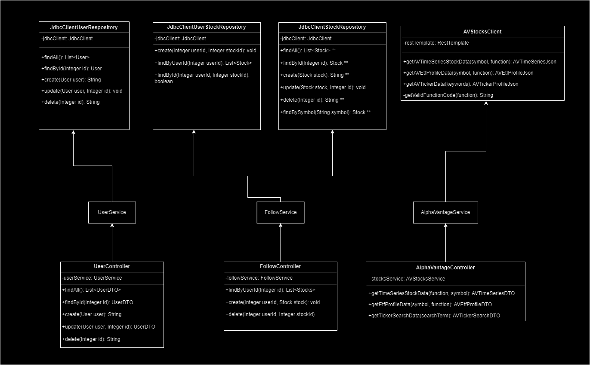
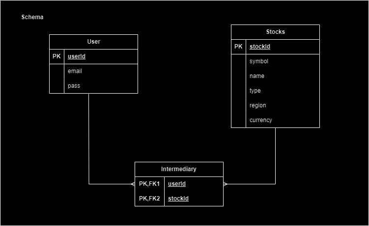

[![Contributors][contributors-shield]][contributors-url]
[![Forks][forks-shield]][forks-url]
[![Stargazers][stars-shield]][stars-url]
[![Issues][issues-shield]][issues-url]
[![MIT License][license-shield]][license-url]
[![LinkedIn][linkedin-shield]][linkedin-url]

# etaStocks

Find frontend code at: [eta-stocks-frontend](https://github.com/TomAston1996/eta-stocks-frontend)

etaStocks is a web application for tracking stock and ETF (Exchange Traded Fund) price data. The backend interfaces with Alpha Vantages stocks API, 
personalising the content for users of the app. The goal of the app is to create a personalised space for monitoring and exploring investments.

## 🧑‍💻 Tech Stack

![Java]
![Spring]
![Postgres]
![Docker]
![Redis]

## 🔧 Setup

### Dependencies
All maven dependencies can be located in ```pom.xml```

### Docker
Docker Engine is required to run the PostreSQL database. 

Change the ```docker-compose.yml``` file to whichever port you want to run your database (default port 5432)

### Alpha Vantage API Key
A free-tier Alpha Vantage API key can be obtained from https://www.alphavantage.co

Add your API key to your ```application.properties``` file:  ```alphaVantageApiKey=[yourApiKey]```

### MVC Architecture



### Database Schema



## 🧑‍🤝‍🧑 Developers 

| Name           | Email                      |
| -------------- | -------------------------- |
| Tom Aston      | mailto:mail@tomaston.dev     |

<!-- MARKDOWN LINKS & IMAGES -->
<!-- https://www.markdownguide.org/basic-syntax/#reference-style-links -->
[contributors-shield]: https://img.shields.io/github/contributors/TomAston1996/eta-stocks-frontend.svg?style=for-the-badge
[contributors-url]: https://github.com/TomAston1996/eta-stocks-frontend/graphs/contributors
[forks-shield]: https://img.shields.io/github/forks/TomAston1996/eta-stocks-frontend.svg?style=for-the-badge
[forks-url]: https://github.com/TomAston1996/eta-stocks-frontend/network/members
[stars-shield]: https://img.shields.io/github/stars/TomAston1996/eta-stocks-frontend.svg?style=for-the-badge
[stars-url]: https://github.com/TomAston1996/eta-stocks-frontend/stargazers
[issues-shield]: https://img.shields.io/github/issues/TomAston1996/eta-stocks-frontend.svg?style=for-the-badge
[issues-url]: https://github.com/TomAston1996/eta-stocks-frontend/issues
[license-shield]: https://img.shields.io/github/license/TomAston1996/eta-stocks-frontend.svg?style=for-the-badge
[license-url]: https://github.com/TomAston1996/eta-stocks-frontend/blob/master/LICENSE.txt
[linkedin-shield]: https://img.shields.io/badge/-LinkedIn-black.svg?style=for-the-badge&logo=linkedin&colorB=555
[linkedin-url]: https://linkedin.com/in/tomaston96
[Java]: https://img.shields.io/badge/java-%23ED8B00.svg?style=for-the-badge&logo=openjdk&logoColor=white
[Spring]: https://img.shields.io/badge/spring-%236DB33F.svg?style=for-the-badge&logo=spring&logoColor=white
[Postgres]: https://img.shields.io/badge/postgres-%23316192.svg?style=for-the-badge&logo=postgresql&logoColor=white
[Docker]: https://img.shields.io/badge/docker-%230db7ed.svg?style=for-the-badge&logo=docker&logoColor=white
[Redis]: https://img.shields.io/badge/redis-%23DD0031.svg?style=for-the-badge&logo=redis&logoColor=white
